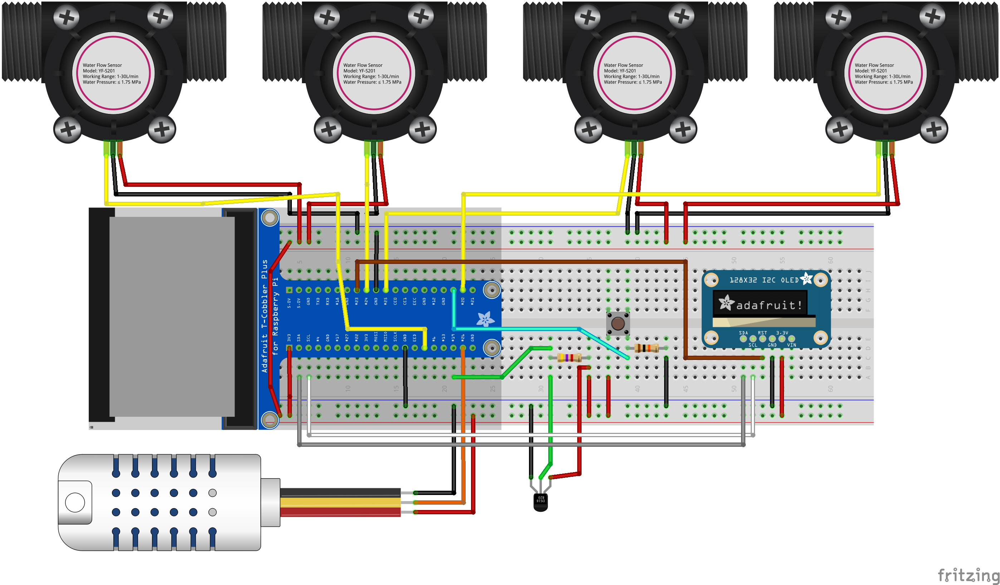

# Danger Brewing: Hub
A NodeBot Kegerator.

## Overview
This "hub" sends data from your kegerator to [Firebase](https://firebase.google.com/), so you can monitor your kegerator in real-time with [Danger Brewing](https://github.com/jonpitch/danger-brewing).

It supports collecting data from:
* Flow meters - to monitor beer distribution
* Sensors - to monitor temperature, humidity, etc.

## Parts

#### Required
* [Raspberry Pi 3](https://www.adafruit.com/products/3055)
* [Cobbler](https://www.adafruit.com/products/2028)
* [5v Power Supply](https://www.adafruit.com/product/1995)
* [MicroSD](https://www.adafruit.com/products/2693)
* [Flow Meter(s)](https://www.adafruit.com/products/828) - 1 for each beer line.
* Operating System - [Raspbian Jessie](https://www.raspberrypi.org/downloads/raspbian/)

#### Optional
* [Monochrome 128x32 OLED](https://www.adafruit.com/products/931)
* [Tactile Button](https://www.adafruit.com/products/367) - required if using a display
* [10K Ohm Resistor](https://www.adafruit.com/products/2784)
* [4.7K Ohm Resistor](https://www.adafruit.com/products/2783)
* [Flow Meter(s)](https://www.adafruit.com/products/828)
* [Temperature + Humidity Sensor](https://www.adafruit.com/product/393)
* [Temperature Sensor](https://www.adafruit.com/product/381)

*The Danger Brewing Hub currently only supports DS18B20 and AM2302 temperature sensors.*

*It also only supports an SSD1306 OLED display.*

## Wiring Diagram

[diagram.fzz](assets/diagram.fzz)

*Shown with all parts*

## Setup Your Pi
* Operating System Installation
  * Download [Raspian Jessie](https://www.raspberrypi.org/downloads/raspbian/) Lite.
  * Put Raspian on your SD card. Follow instructions [here](https://www.raspberrypi.org/documentation/installation/installing-images/README.md)
* Opearting System Configuration
  * Initially, you will need an external display and keyboard. Get those, plug in and power on the pi.
    * When your pi boots up, log in with:
      * username: `pi`
      * password: `raspberry` (we'll change this later)
  * Type `sudo raspi-config`
    * Expand file system
    * Internationalization options - adjust as necessary.
    * Change your password - if you want
    * `Advanced Options - Hostname` - chane the hostname of your Pi (optional)
    * `Advanced Options - Enable I2C`
    * `Advanced Options - Enable One-Wire`
    * `Advanced Options - Enable SSH`
    * Reboot
  * Setup Wifi
    * Follow the instructions [here](https://www.raspberrypi.org/documentation/configuration/wireless/wireless-cli.md)
      * You can now ditch your keyboard and display.
      * `sudo reboot`
      * Find the IP address of your Pi on your network
      * `ssh pi@192.168.x.x`
      * Enter password: `raspberry`
  * Install updates
    * `sudo apt-get update`
    * `sudo apt-get upgrade`
  * Install `node`
    * `cd /tmp`
    * `wget http://node-arm.herokuapp.com/node_latest_armhf.deb`
    * `sudo dpkg -i node_latest_armhf.deb`
  * Install `git`
    * `sudo apt-get install git`
* Danger Brewing Configuration
  * Support for `BCM2835` one-wire sensor:
    * `cd /tmp`
    * `wget http://www.airspayce.com/mikem/bcm2835/bcm2835-1.50.tar.gz`
    * `tar xvfz bcm2835-1.49.tar.gz`
    * `cd bcm2835-1.49/`
    * `./configure`
    * `make`
    * `sudo make install`
  * Support for `DS18B20` one-wire sensor:
    * *Your circuit should be setup, (see wiring diagram)*
    * `sudo nano /boot/config.txt`
    * At the end of this file, add: `dtoverlay=w1-gpio,gpiopin=XX`
      * `XX` is the GPIO pin your sensor is plugged in to.
    * `sudo modprobe w1-gpio pullup=1`
    * `sudo modprobe w1-therm strong_pullup=1`
  * Reboot your pi
    * `sudo reboot`

## Setup The Application & Sensors
* First setup your Danger Brewing application with Firebase.
  * Follow the directions found [here](https://github.com/jonpitch/danger-brewing#configuration)
* Setup `Service Account`
  * Follow the instructions [here](https://firebase.google.com/docs/server/setup)
  * Hold on to this `.json` file.
* Get the Code
  * `cd /home/pi`
  * `git clone https://github.com/jonpitch/danger-brewing-hub.git`
  * `cd /danger-brewing-hub`
  * `npm install`
  * reboot your pi: `sudo reboot`
* Setup your configuration
  * From your computer:
    `scp <your service account .json file> pi@192.168.x.x:/home/pi/danger-brewing-hub/config/service-account.json`
  * From the pi: `cp /config/default.example.json /config/default.json`
  * Update `firebase` `ENV` values with your own.
  * Update `hub.id` with your hub id from Firebase.
  * Configure taps:
    * `tap.id` should map to a tap in Firebase.
    * `tap.pin` should map to a pin your flow meter is connected to. See [here](https://github.com/nebrius/raspi-io/wiki/Pin-Information) for more information.
  * Configure sensors (optional):
    * If you don't have any, leave as an empty array `[]`
    * `am2302` sensors:
      * `type`: Should remain `am2302`
      * `id`: Should map to a Firebase id
      * `pin`: Should be an integer, the GPIO pin your sensor is connected to.
      * `polling`: A value in milliseconds, how often this sensor should send data.
    * `ds18b20` sensors:
      * `type`: Should remain `ds18b20`
      * `id`: Should map to a Firebase id
      * `address`: Should map to your sensors address
        * To find this address, there's a good overview [here](https://cdn-learn.adafruit.com/downloads/pdf/adafruits-raspberry-pi-lesson-11-ds18b20-temperature-sensing.pdf)
        * If you followed the OS setup and your sensor is installed properly:
          * `cd /sys/bus/w1/devices`
          * `ls`
          * The `28-xxx` is your address.
      * `polling`: A value in milliseconds, how often this sensor should send data.
  * Configure display (optional):
    * If you don't have one, remove it from the config.
    * `type`: `ssd1306` (the only display currently supported)
    * `w`: How many columns wide (64, 128, etc.)
    * `h`: How many rows high (32, 64, etc.)
    * `address`: The I2C address of the display
      * *If your display is hooked up correctly:* `i2cdetect -y 1`
      * If you need help understanding the output, try [here](https://learn.adafruit.com/adafruits-raspberry-pi-lesson-4-gpio-setup/configuring-i2c#testing-i2c)
    * `toggle`: This should be your toggle's [pin](https://github.com/nebrius/raspi-io/wiki/Pin-Information).
    * If you're feeling crazy, `greetings` and `goodbyes` are messages to display at random when you turn on or off your display. *tip: keep them short*.
  * Run the hub
    * `cd /home/pi/danger-brewing-hub`
    * `./run.sh`
  * Checking for updates
    * `cd /home/pi/danger-brewing-hub`
    * `git pull`

## Developers

#### Building
* `npm run build`

*Output is in `/lib`*

#### Running
* `./run.sh`

#### Contributing
* Feel free to help out. Take a look if there are any open [issues](https://github.com/jonpitch/danger-brewing-hub/issues), bugs or if you want to just make the danger-brewing-hub better, go for it!

#### Additional Resources
* [Johnny Five](http://johnny-five.io/)
* [Raspi-IO](https://github.com/nebrius/raspi-io)
* [oled-js](https://github.com/noopkat/oled-js)
* [node-dht-sensor](https://github.com/momenso/node-dht-sensor)
* [ds18x20](https://github.com/mraxus/ds18x20.js)
* [Raspberry Pi Pin Information](https://github.com/nebrius/raspi-io/wiki/Pin-Information)
* [Fritzing - Wire Diagrams](http://fritzing.org/home/)
